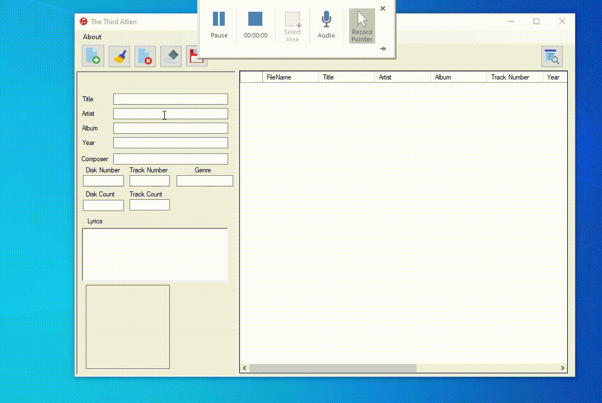

Welcome to The Third Alien - MP3 Tagger with iTunes Library search
===================

The year was 2016. I decided to build a mp3 tagger that gets info from iTunes library (well, because itunes have the biggest library ofc) myself. So, this is my fun summer project. :)

> Features:
> - Clear tags from file
> - Search by keywords from iTunes library and automatically insert basic tags(title, artist name, album name, album artwork etc) to file

Big thanks to the developers who created the packages used in this project.
----------
> **Instructions:**

> - Download the release package from [here](https://www.dropbox.com/s/ft1ha36kzaxgzsc/TheThirdAlien_MP3Tagger.zip?dl=0 "here") and unzip .
> - Run `setup.exe` and program will automatically install itself.

----------
> **Note:**

> - Tool will tag files only one by one.
> - Tool will only allow .mp3 or .m4a files.
> - There's not much error handling, so if it crashes or exits,  please try again patiently :D

