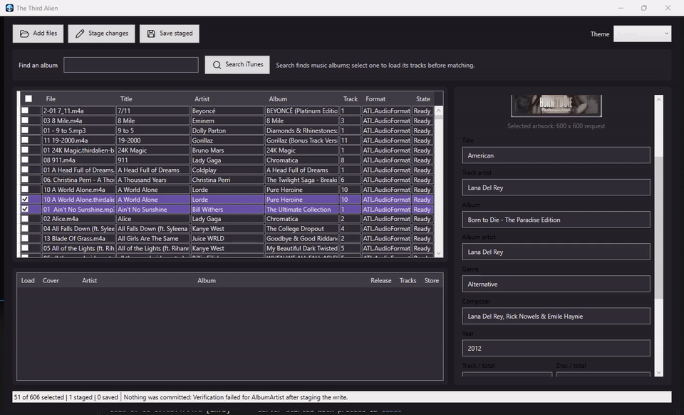

# The Third Alien

<p align="center">
  
</p>

The Third Alien is a Windows audio metadata editor. It finds music-album information in Apple’s public iTunes catalog, lets you review and edit tags in local audio files, and saves through a copy, verify, and backup workflow.

It began as a small Windows Forms project in 2016. The current rewrite is a .NET 10 WPF application that keeps the original idea while adding safer file writes, album matching, artwork selection, full-tag editing, and light/dark themes.

> **Development status:** the modern rewrite is usable for local editing and reviewable album batch tagging. Release builds provide a self-contained Windows x64 portable ZIP and an installer EXE.

## Quick walkthrough



The recording uses a disposable local MP3 and shows the actual import, selection, edit, stage, and save workflow.

## What it does

- Imports local MP3, M4A/AAC, FLAC, Ogg, Opus, WAV, AIFF/AIF, WMA, and M4B files when ATL can safely read them.
- Shows core tags for the selected file: title, track artist, album, album artist, genre, composer, year, track/disc numbering, and unsynchronized lyrics.
- Stages core-tag edits before saving them.
- Opens **Full tags** for every readable standard and additional field. You can add a field, select a row, edit its name/value, and save it through the same verified write path.
- Reads existing embedded front-cover artwork and lets you choose a replacement image. The app requests 600 × 600 artwork from Apple where available.
- Searches Apple’s catalog for music album collections, not podcasts or raw track results.
- Loads an album’s track list and presents aligned numbered rows to match selected files. Reorder the files with the arrow controls, then write metadata to confirmed pairs.
- Supports System, Light, and Dark themes, selected-row highlighting, labelled controls, and keyboard-accessible buttons.

The app edits metadata only. It does not play, transcode, download, decrypt, or delete audio. It cannot recreate store ownership, purchase, account, or DRM information from an iTunes purchase.

## How album lookup works

1. Add local audio files.
2. Check the files that belong to one album.
3. Search by album or artist and choose an edition from the music-album results.
4. Select **Load tracks**.
5. Align selected files with the numbered Apple track list using the mapping window.
6. Write tags for rows containing both a catalog track and a selected file.

The catalog client uses Apple’s unauthenticated [iTunes Search API](https://developer.apple.com/library/archive/documentation/AudioVideo/Conceptual/iTuneSearchAPI/index.html). Its primary query is restricted to `media=music` and `entity=album`. A narrow fallback may promote a song result only where its `collectionName` exactly matches the entered album title; it still appears as an album, never as a raw track.

Apple catalog values map well to title, artist, album, album artist, release year, genre, copyright, track/disc number and totals, explicitness, and artwork. Values such as product URLs, prices, currency, preview URLs, catalog IDs, and streaming availability are catalog/store data, not normal audio metadata, so the app does not write them as song tags.

## Tag safety and tag scope

Every core, full-tag, and artwork write follows this sequence:

1. Copy the original to a temporary file in the same directory.
2. Apply the requested change to the copy.
3. Reopen the copy and verify the requested tags or cover data.
4. Replace the original only after verification succeeds.
5. Leave a timestamped backup beside the edited file.

Core edits expose the tags most people use every day. **ISRC** and **Website** are valid optional metadata fields, but Apple’s public iTunes Search response does not provide them; they are deliberately absent from the normal editor. If they already exist in a file, they remain visible in **Full tags**.

Custom/additional fields depend on the tagging format and the capabilities of the underlying file. The app reports write or verification failures rather than claiming an unsupported custom field was saved.

The URL-cleaning logic is deliberately conservative: during album batch tagging it cleans retained Composer, Lyrics, and Website values only when it confidently identifies a website URL. Non-URL values are preserved.

## Compatibility

| Area | Current target |
| --- | --- |
| Operating system | Windows 11 x64 validated locally; WPF requires Windows |
| Runtime | .NET 10 (`net10.0-windows`) |
| File formats | MP3, M4A/AAC, FLAC, Ogg/Oga, Opus, WAV, AIFF/AIF, WMA, M4B when ATL supports the file’s tag layout |
| Catalog | Apple iTunes Store public Search/Lookup API; availability varies by storefront |
| Artwork | Embedded front cover; Apple CDN request targets 600 × 600 where the release offers it |

File extensions alone do not prove a container is readable or writable. Keep your own backup of important music before editing it.

## Build and run

Install the SDK pinned in [global.json](global.json), then run:

```powershell
dotnet restore ThirdAlien.slnx
dotnet build ThirdAlien.slnx --configuration Release
dotnet test ThirdAlien.slnx --configuration Release
dotnet run --project src/ThirdAlien.App/ThirdAlien.App.csproj --configuration Release
```

## Release builds

A release includes two Windows x64, self-contained artifacts:

- `TheThirdAlien-<version>-win-x64-portable.zip`: unzip and run `ThirdAlien.App.exe`; no .NET runtime install is needed.
- `TheThirdAlien-Setup-<version>-win-x64.exe`: modern Inno Setup installer with Start-menu and optional desktop shortcuts.

Build both locally with Inno Setup 6 installed:

```powershell
.\scripts\Publish-Release.ps1 -Version 0.1.0
```

The command restores for `win-x64`, builds, runs the test suite, publishes the self-contained app, creates the portable ZIP, and compiles the installer. Outputs are written to the ignored `artifacts/` directory.

[`.github/workflows/release.yml`](.github/workflows/release.yml) automates the same build on GitHub-hosted Windows runners. Run it manually from **Actions** to receive downloadable workflow artifacts, or push a signed-off version tag such as `v0.1.0` to create a GitHub Release with both files and generated release notes.
## Project layout

| Project | Responsibility |
| --- | --- |
| `src/ThirdAlien.App` | WPF user interface, themes, view models, dialogs, and icons |
| `src/ThirdAlien.Core` | Metadata model, catalog contracts, URL cleanup, and matching rules |
| `src/ThirdAlien.Infrastructure` | Apple catalog client, ATL adapter, and safe file commit service |
| `tests/ThirdAlien.Tests` | Unit tests for matching, URL cleaning, and safe commit behavior |

## Dependencies

| Dependency | Version | Purpose |
| --- | ---: | --- |
| .NET SDK | 10.0.401 | Build SDK and `net10.0` target |
| [ATL.NET / z440.atl.core](https://www.nuget.org/packages/z440.atl.core/7.16.0) | 7.16.0 | Audio metadata and embedded-artwork read/write |
| [CommunityToolkit.Mvvm](https://www.nuget.org/packages/CommunityToolkit.Mvvm/8.4.2) | 8.4.2 | Observable view models and commands |
| [FluentIcons.Wpf](https://www.nuget.org/packages/FluentIcons.Wpf/2.1.339.1) | 2.1.339.1 | Fluent action icons |
| Microsoft.NET.Test.Sdk | 17.12.0 | Test host |
| xUnit | 2.9.3 | Unit-test framework |

Versions are centrally pinned in [Directory.Packages.props](Directory.Packages.props).

## Verification

The current suite contains 11 passing tests covering URL detection/cleaning, track matching, and temporary-copy verification with backup preservation. The release build is also launched locally as a WPF smoke check.

Remaining release work includes real MP3/M4A full-tag and artwork round-trip tests, a portable build, installer packaging, GitHub Releases, and a recorded GIF demonstration.

See [the code review](docs/CODE_REVIEW.md), [the modernization plan](docs/MODERNIZATION_PLAN.md), and the active [project checklist](AGENTS.md).

## License

[MIT](LICENSE)